Notes from the edge of a problem.

I keep a small Node site on Dokploy. People still ask what it "runs on," as if there is a secret rack of boxes behind the blog. There is not. There is one container, markdown on disk, and a few Express routes.

Then I tried the trick from [GitHub URL tricks worth stealing](/writings/github-url-tricks): change `github.com` to `gitdiagram.com` on the repo URL. GitDiagram drew the stack, with clickable nodes that jump straight into the files.

Full export (PNG):

## Interactive Mermaid (click a box)

Same diagram as Mermaid. `securityLevel` is set to `loose` on this site so the GitDiagram `click` lines actually open GitHub. Tap a node.

```mermaid
flowchart TD

subgraph group_delivery["Live Delivery"]
  node_dokploy["Dokploy Ingress"]
  node_express["Express App<br/>[index.js]"]
end

subgraph group_frontend["Browser Frontend"]
  node_static["Static Assets<br/>[index.html]"]
  node_client["Frontend Controller<br/>[app.js]"]
  node_styles["Responsive Styling<br/>[styles.css]"]
end

subgraph group_api["Application API"]
  node_showcase["Showcase Endpoint<br/>[index.js]"]
  node_bloglist["Blog List Endpoint<br/>[index.js]"]
  node_article["Article Endpoint<br/>[index.js]"]
  node_health["Health Endpoint<br/>[index.js]"]
  node_parser["Markdown Renderer<br/>[index.js]"]
end

subgraph group_content["Content Sources"]
  node_showcaseconfig["Showcase Config<br/>[showcase.json]"]
  node_blogposts["Markdown Articles"]
end

subgraph group_optional["Optional Infrastructure"]
  node_nginx["Optional Nginx"]
  node_waf["Optional WAF"]
end

node_visitor(("Visitor Browser"))
node_github["GitHub API"]

node_visitor -->|"requests pages"| node_dokploy
node_dokploy -->|"routes traffic"| node_express
node_express -->|"serves assets"| node_static
node_visitor -->|"checks health"| node_health
node_client -->|"fetches projects"| node_showcase
node_client -->|"fetches writings"| node_bloglist
node_client -->|"fetches article"| node_article
node_client -->|"uses styles"| node_styles
node_showcase -->|"reads config"| node_showcaseconfig
node_showcase -->|"fetches metadata"| node_github
node_showcase -->|"returns projects"| node_client
node_bloglist -->|"reads articles"| node_blogposts
node_bloglist -->|"renders Markdown"| node_parser
node_bloglist -->|"returns summaries"| node_client
node_article -->|"reads article"| node_blogposts
node_article -->|"renders Markdown"| node_parser
node_article -->|"returns HTML"| node_client
node_nginx -.->|"proxies traffic"| node_express
node_waf -.->|"filters traffic"| node_nginx

click node_express "https://github.com/chkp-bryans/bryansmith.tech/blob/main/server/index.js"
click node_static "https://github.com/chkp-bryans/bryansmith.tech/blob/main/public/index.html"
click node_client "https://github.com/chkp-bryans/bryansmith.tech/blob/main/public/js/app.js"
click node_styles "https://github.com/chkp-bryans/bryansmith.tech/blob/main/public/css/styles.css"
click node_showcase "https://github.com/chkp-bryans/bryansmith.tech/blob/main/server/index.js"
click node_bloglist "https://github.com/chkp-bryans/bryansmith.tech/blob/main/server/index.js"
click node_article "https://github.com/chkp-bryans/bryansmith.tech/blob/main/server/index.js"
click node_health "https://github.com/chkp-bryans/bryansmith.tech/blob/main/server/index.js"
click node_parser "https://github.com/chkp-bryans/bryansmith.tech/blob/main/server/index.js"
click node_showcaseconfig "https://github.com/chkp-bryans/bryansmith.tech/blob/main/config/showcase.json"
click node_blogposts "https://github.com/chkp-bryans/bryansmith.tech/tree/main/content/blog"
click node_nginx "https://github.com/chkp-bryans/bryansmith.tech/tree/main/nginx"
click node_waf "https://github.com/chkp-bryans/bryansmith.tech/tree/main/waf"

classDef toneNeutral fill:#f8fafc,stroke:#334155,stroke-width:1.5px,color:#0f172a
classDef toneBlue fill:#dbeafe,stroke:#2563eb,stroke-width:1.5px,color:#172554
classDef toneAmber fill:#fef3c7,stroke:#d97706,stroke-width:1.5px,color:#78350f
classDef toneMint fill:#dcfce7,stroke:#16a34a,stroke-width:1.5px,color:#14532d
classDef toneRose fill:#ffe4e6,stroke:#e11d48,stroke-width:1.5px,color:#881337
classDef toneIndigo fill:#e0e7ff,stroke:#4f46e5,stroke-width:1.5px,color:#312e81
classDef toneTeal fill:#ccfbf1,stroke:#0f766e,stroke-width:1.5px,color:#134e4a
class node_dokploy,node_express,node_visitor toneBlue
class node_static,node_client,node_styles toneAmber
class node_showcase,node_bloglist,node_article,node_health,node_parser,node_github toneMint
class node_showcaseconfig,node_blogposts toneRose
class node_nginx,node_waf toneIndigo
```

## What the picture is saying

**Live path today:** browser → Dokploy ingress (TLS) → Express on port 3000 → static files and `/api/*`.

**Optional path in the repo, not wired in production:** `waf/` and `nginx/` still sit in Git. GitDiagram drew them with dashed edges. That matches reality. They are shelves, not the front door.

**Frontend:** `public/index.html`, `public/js/app.js`, and `public/css/styles.css` load the page, then fetch showcase and writings from the API.

**API:** health, showcase (optional GitHub enrichment + `config/showcase.json`), blog list, and article render via `marked`.

If you want the URL-swap cheat sheet that led here, read [GitHub URL tricks worth stealing](/writings/github-url-tricks).

Try it on this repo: [gitdiagram.com/chkp-bryans/bryansmith.tech](https://gitdiagram.com/chkp-bryans/bryansmith.tech).
